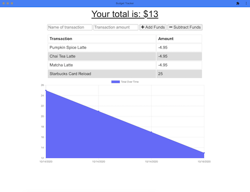

# Budget-Buddy  
  

  ## Deployed
  https://budget-buddy-20.herokuapp.com/
  
  ## Description 
  Budget Buddy is a progressive web application that allows users to add deposits and expenses while online or offline. It is ideal for travelers who'd like to track their money at any time. 

  

  ## Table of Contents
  * [Installation](#installation)
  * [Usage](#usage)
  * [License](#license)
  * [Contributing](#contributing)
  * [Test Instructions](#test-instructions)
  * [Questions](#questions)

  ## Installation
    
    1. To use this code for your own project, download the Budget-Buddy repository locally to your computer.   
    2. Run npm install in your bash/command line.

  ## Usage
      
    1. To run application, invoke with node server.js (npm start) in your bash/command line. 
    2. View the live application in your browser at localhost:3000

  ## License
  MIT (c) Hoang Nguyen   
  See LICENSE.md for details.

  ## Contributing
  Please check the app's GitHub issue tracker for known issues. Report bugs and requests to GitHub Issues.

  ## Test Instructions
  Install and run the application per instructions above. If using nodemon your terminal should display 'Server listening on: http://localhost:3000'. Check your terminal and web console for errors.

  ## Questions
  For questions, reach out to the team and I here:  
  Github: https://github.com/hngdngng  
  Email: [hoang.d.nguyen@outlook.com](mailto:hoang.d.nguyen@outlook.com)
  
